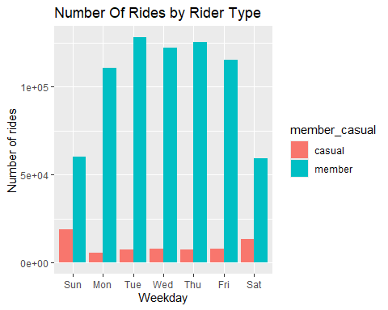
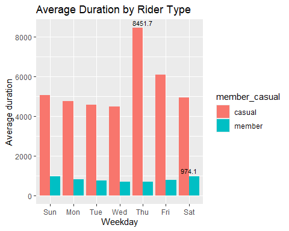

# How do annual members and casual riders use Cyclistic bikes differently?


### Introduction

Cyclistic bike-share is a bike program that features more than 5,800 bicycles and 600 docking stations, it offers reclining bikes, hand tricycles and cargo bikes, making bike-share more inclusive to people with disabilities and riders who can’t use a standard two-wheeled bike. The majority of riders opt for traditional bikes; about 8% of riders use the assistive options. It’s users are more likely to ride for leisure, but about 30% use the bikes to commute to work each day.

There are single-ride passes and full-day passes, which are purchased by casual riders, and Cyclistic members who purchase the annual memberships. Annual members are much more profitable than casual riders, the company believes that maximizing the number of annual members would be the key to future growth. 

The goal is to design marketing strategies to convert casual riders into annual members. To do this it’s better to understand how annual members and casual riders differ, what would make casual riders buy a membership and how they have used the services. Here we will look into how they use the Cyclistic bikes differently. 

### Data description and methodology

The data has been made available by Motivate International Inc. as public data. The Divvy data was downloaded, stored and viewed for analysis. Before 2020 Divvy used different labels for two types of riders, we consolidated from four labels fond in the recent data to two labels (namely member and casual).We used time logs which has start stations and end stations, these time logs were stored in excel spread sheets. Since the data had shown negative tripdurations and this was due to bikes being out of circulation for Quality Control reasons, we deleted those rides.  

The time log data of two different time-frames was stored on a spread sheets. A comparison was drawn between the two types of data which was the first quarter of 2019 and the first quarter of 2020, we then cleaned, performed calculations and plotted graphs in order to gain insights. A comparison between different types of users allowed us to obtain their usage of the bike services. 

### Analysis and findings

#### Setting up my environment

Set up the R environment by loading the 'tidyverse', manage conflicts and set up the dplyr choices: 

```{r loading packages, message=FALSE}
library(tidyverse)
library(conflicted)
conflict_prefer("filter","dplyr")
conflict_prefer("lag","dplyr")
library(knitr)
```

Collected the data and uploaded the datasets: 

```{r loading the datasets, message=FALSE}
q1_2019 <- read_csv("Divvy_trips_2019_Q1.csv")
q1_2020 <- read_csv("Divvy_trips_2020_Q1.csv")
```


#### Cleaning the data

The data was downloaded, renamed the columns to make them consistent and inspected:

```{r compared each file, echo=TRUE, results='hide'}
colnames(q1_2019)
colnames(q1_2020)
(q1_2019 <- rename(q1_2019, ride_id = trip_id
                   ,rideable_type = bikeid
                   ,started_at = start_time
                   ,ended_at = end_time
                   ,start_station_name = from_station_name
                   ,start_station_id = from_station_id
                   ,end_station_name = to_station_name
                   ,end_station_id = to_station_id
                   ,member_casual = usertype))
str(q1_2019)
str(q1_2020)
```

Cleaned and combined the data into a single file: 

```{r converting ride_id and rideable_type to character, results='hide'}
q1_2019 <- mutate(q1_2019, ride_id=as.character(ride_id)
                  ,rideable_type=as.character(rideable_type))
all_trips <- bind_rows(q1_2019, q1_2020)
all_trips <- all_trips %>% 
  select(-c(start_lat, start_lng, end_lat, end_lng, birthyear, gender,  "tripduration"))
colnames(all_trips)
nrow(all_trips) #rows in the data frame
dim(all_trips) #dimensions of the data frame
head(all_trips)
tail(all_trips)
str(all_trips)
summary(all_trips)
all_trips <-  all_trips %>% 
  mutate(member_casual = recode(member_casual
                                ,"Subscriber" = "member"
                                ,"Customer" = "casual"))
table(all_trips$member_casual)
```

Added some columns to aggregate the ride data: 

```{r aggregate the ride data}
all_trips$date <- as.Date(all_trips$started_at)
all_trips$month <- format(as.Date(all_trips$date), "%m")
all_trips$day <- format(as.Date(all_trips$date), "%d")
all_trips$year <- format(as.Date(all_trips$date), "%Y")
all_trips$day_of_week <- format(as.Date(all_trips$date), "%A")
```

Preparing data fields in order to perform calculations for ride_lengths (in seconds): 

```{r echo=TRUE, results='hide'}
all_trips$ride_length <- difftime(all_trips$ended_at, all_trips$started_at)
str(all_trips)
is.factor(all_trips$ride_length)
all_trips$ride_length <- as.numeric(as.character(all_trips$ride_length))
is.numeric(all_trips$ride_length)
```

Removed bad data and created a new cleaned dataframe: 

```{r creating a new dataframe}
all_trips_v2 <- all_trips[!(all_trips$start_station_name == "HQ QR" | all_trips$ride_length<0),]
```

Descriptive analysis on ride_length (in seconds): 

```{r echo=TRUE, results='hide'}
mean(all_trips_v2$ride_length) #(total ride length / rides)
median(all_trips_v2$ride_length) #midpoint
max(all_trips_v2$ride_length) #longest ride
min(all_trips_v2$ride_length) #shortest ride
summary(all_trips_v2$ride_length)
aggregate(all_trips_v2$ride_length ~ all_trips_v2$member_casual, FUN = mean)
aggregate(all_trips_v2$ride_length ~ all_trips_v2$member_casual, FUN = median)
aggregate(all_trips_v2$ride_length ~ all_trips_v2$member_casual, FUN = max)
aggregate(all_trips_v2$ride_length ~ all_trips_v2$member_casual, FUN = min)
aggregate(all_trips_v2$ride_length ~ all_trips_v2$member_casual + all_trips_v2$day_of_week, FUN = mean)
all_trips_v2$day_of_week <- ordered(all_trips_v2$day_of_week, levels=c("Sunday","Monday","Tuesday","Wednesday","Thursday","Friday","Saturday"))
```

Calculation of the ride length of each member by day of the week: 

```{r average ride time by each day for members vs casual riders, echo=TRUE, message=FALSE, warning=FALSE, results='hide'}
aggregate(all_trips_v2$ride_length ~ all_trips_v2$member_casual + all_trips_v2$day_of_week, FUN = mean)
all_trips_v2 %>% 
  mutate(weekday = wday(started_at, label = TRUE)) %>% 
  group_by(member_casual, weekday) %>% 
  summarise(number_of_rides = n(), average_duration = mean(ride_length)) %>% 
  arrange(member_casual, weekday)
summary_data <- all_trips_v2 %>%
  mutate(weekday = wday(started_at, label = TRUE)) %>%
  group_by(member_casual, weekday) %>%
  summarise(number_of_rides = n(), average_duration = mean(ride_length), .groups = "drop")
```
```{r view the created table, echo=FALSE}
kable(summary_data, caption = "Average duration & ride count by weekday and rider type")
```


#### Plots

Plotted the graph to investigate the number of rides and the average ride duration by each user type

```{r number of rides by rider type, echo=FALSE, message=FALSE, warning=FALSE}
all_trips_v2 %>% 
  mutate(weekday = wday(started_at, label = TRUE)) %>% 
  group_by(member_casual, weekday) %>%
  summarise(number_of_rides = n(), average_duration = mean(ride_length)) %>% 
  arrange(member_casual, weekday)  %>% 
  ggplot(aes(x = weekday, y = number_of_rides, fill = member_casual)) +
  geom_col(position = "dodge") + 
  labs(title = "Number Of Rides by Rider Type", x = "Weekday", y = "Number of rides")
```


```{r average duration by rider type, echo=FALSE, message=FALSE, warning=FALSE}
summary_data <- all_trips_v2 %>% 
  mutate(weekday = wday(started_at, label = TRUE)) %>% 
  group_by(member_casual, weekday) %>% 
  summarise(number_of_rides = n(), average_duration = mean(ride_length)
            , .groups = "drop")
max_labels <- summary_data %>% 
  group_by(member_casual)  %>% 
  filter(average_duration == max(average_duration))
ggplot(summary_data, aes(x = weekday, y = average_duration, fill = member_casual))+
  geom_col(position = "dodge") +
  geom_text(data = max_labels, aes(label = round(average_duration, 1))
            ,position = position_dodge(width = 0.9),vjust = -0.5,hjust = 0.5
            ,color = "black", size = 3.0) +
  labs(title = "Average Duration by Rider Type", x = "Weekday", y = "Average duration")
```



#### Findings

Looking at the graphs we saw that: 

* Members take more rides during the week than on weekends 
* Casual riders take more rides on weekends than during the week 
* Overall members have more number of rides than the casual riders. 

When we looked at the average ride duration we saw that casual riders have more ride duration than the members and we saw a peek at 8451.7 seconds by casual riders from Thursday, indicating that casual riders ride longer from Thursday to Sunday. 

### Recommendations

The insights gained from this analysis mean that: 

- Casual riders use the full-day passes more often, hence the higher ride duration 
- Annual members were riding to commute to work on weekdays and for leisure on weekends. 

Since  we know that annual members are much more profitable than casual riders and the company believes in maximizing the number of annual members, the goal should be to design marketing strategy to convince casual riders to use the services for both commuting to work and for leisure.


### Concusion

In this case study, we used the Cyclistic bike-share company data to evaluate how casual riders and annual members use of the services differently; determined trends and theorized what was causing them. We were then able to device a corrective action plan based on those findings. The investigation has yielded proof that they do use them differently depending to the day of week. 
